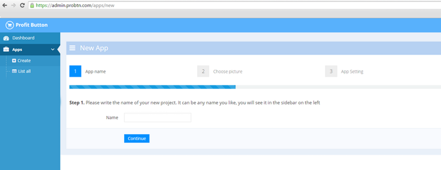
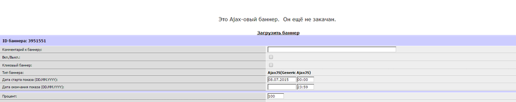
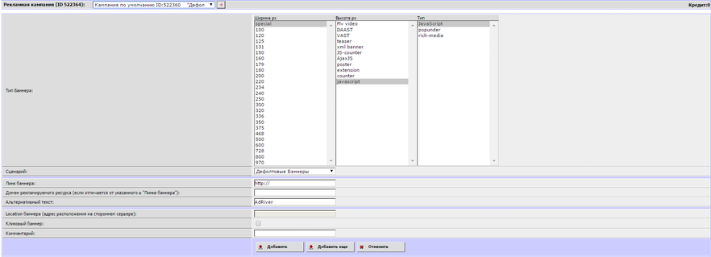

.. probtn documentation master file, created by
   sphinx-quickstart on Mon Nov  2 12:32:08 2015.
   You can adapt this file completely to your liking, but it should at least
   contain the root `toctree` directive.
 
.. _adriver:
 
Integrtion with AdRiver
==================================

Integrtion with AdRiver (modificated code)
----------------------------------
You need to make this steps:

Step0
^^^^^^^^^^^^^^^^^^^^^^^^^^^^^^^^^
Create a campaign (or an app with the necessary domain, real or a domain identifier)
 

Step1
^^^^^^^^^^^^^^^^^^^^^^^^^^^^^^^^^
Create a page available at the address on the same domain where the button is to be displayed.

On the page, add showinparent_concat.js 

````

For example:
 
.. code-block:: html

	<!DOCTYPE html>
	<html>
	<head lang="en">
			<meta charset="utf-8">
			<meta name="viewport" content="width=device-width, initial-scale=1">
			<title>probtn (hackpad)</title>
	</head>
	<body>
			
	</body>
	</html>
 
Step2
^^^^^^^^^^^^^^^^^^^^^^^^^^^^^^^^^
Create an AjaxJS (Generic AjaxJS) banner

.. image:: images/adriver/adriver2_step1.png

Step3
^^^^^^^^^^^^^^^^^^^^^^^^^^^^^^^^^
Upload a code for the banner (click on “Upload banner”)

Code example for "generic ajax" banner

https://www.dropbox.com/s/vo4deq8g9e9yynp/generic_ajaxjs.zip?dl=0

.. image:: images/adriver/adriver2_step3_1.png

Step 4
^^^^^^^^^^^^^^^^^^^^^^^^^^^^^^^^^
Change the path from index.html to showinparent.html (example in the archive) (created in Step1)

``<iframe style="border: 0px; width: 0px; height: 0px; display: none;" src="http://example.com/showinparent.html?domain=nessasary_example_app_domain.test"></iframe>``

Url ``//example.com/showinparent.html?domain=nessasary_example_app_domain.test`` is an example, use your own path (to the page created on step 1)

Change the value of the GET param of the domain (cited as an example) from ``nessasary_example_app_domain.test`` to the necessary domain (identifier) used in the appropriate app at ``admin.viewst.com``
 
Set campaign (optional)
^^^^^^^^^^^^^^^^^^^^^^^^^^^^^^^^^

It's possible to use campaign id, so probtn would show creatives only from selected campaign fro app.
To do so, you should:
 
Create ad with code

``<iframe style="border: 0px; width: 0px; height: 0px; display: none;"  src="//example.com/example_iframe_page.html?domain=nessasary_example_app_domain.test&SelectAdSet=565e021f99c27511100000d0"></iframe>``

Url //example.com/example_iframe_page.html добавлен для примера, is an example, use your own path (to the page created on step 1)

Also value of GET param domain (for example) ``nessasary_example_app_domain.test`` should be replaced on nessesary (id), used in nessesary app in admin.viewst.com

Value of GET param SelectAdSet (for example) ``565e021f99c27511100000d0`` should be replaced on nessesary campaign id (don't use placement or creative id).

Campaign ID could be found  at url, if you open campaign page at admin.viewst.com.

.. image:: images/adriver/adriver2_step3_2.png

Integrtion with AdRiver (javascript/JavaScript banner)
----------------------------------

For this integration type follow these steps:

Step0
^^^^^^^^^^^^^^^^^^^^^^^^^^^^^^^^^

Create a campaign (or an app with the necessary domain, real or a domain identifier)

Step1
^^^^^^^^^^^^^^^^^^^^^^^^^^^^^^^^^

Create ``special -> javascript -> JavaScript`` banner

Step2
^^^^^^^^^^^^^^^^^^^^^^^^^^^^^^^^^

Upload banner code

As code you can use concatenated probtn script, called ( http://cdn.viewst.com/showinparent_concat.js ):
( :ref:`description` )

.. code-block:: javascript
	
	(function () {
	var oHead = window.top.document.getElementsByTagName('HEAD').item(0);

	function loadJS(src, callback) {
		var s = window.top.document.createElement('script');
		s.src = src;
		s.async = true;
		s.onreadystatechange = s.onload = function () {
			var state = s.readyState;
			if (!callback.done && (!state || /loaded|complete/.test(state))) {
				callback.done = true;
				callback();
			}
		};
		window.top.document.getElementsByTagName('head')[0].appendChild(s);
	}

	function getParameterByName(name) {
			try {
		name = name.replace(/[\[]/, "\\[").replace(/[\]]/, "\\]");
		var regex = new RegExp("[\\?&]" + name + "=([^&#]*)"),
			results = regex.exec(location.search);
		return results === null ? "" : decodeURIComponent(results[1].replace(/\+/g, " "));
			} catch(ex) {

			}
	}

	var params = {};
	params.dfp = {};
	params.dfp.isDFP = true;
	params.dfp.clickUrlEsc = getParameterByName("click_url_esc");
	params.dfp.cacheBuster = getParameterByName("cacheBuster");
	var domain = getParameterByName("domain");
	if ((domain!==null) && (domain!==undefined) && (domain!=="")) {
			params.domain = domain;
	}
	//selectAdSet param
	var SelectAdSet = getParameterByName("SelectAdSet");
	if ((SelectAdSet!==null) && (SelectAdSet!==undefined) && (SelectAdSet!=="")) {
			params.SelectAdSet = SelectAdSet;
	}

	var paramsDiv = window.top.document.createElement('div');
	paramsDiv.id = "probtn_additional_params";
	paramsDiv.innerHTML = JSON.stringify(params);
	paramsDiv.style.cssText = "display: none;";
	window.top.document.body.appendChild(paramsDiv);

	loadJS('//cdn.viewst.com/probtn_concat.js', function () {
	});
	})();

