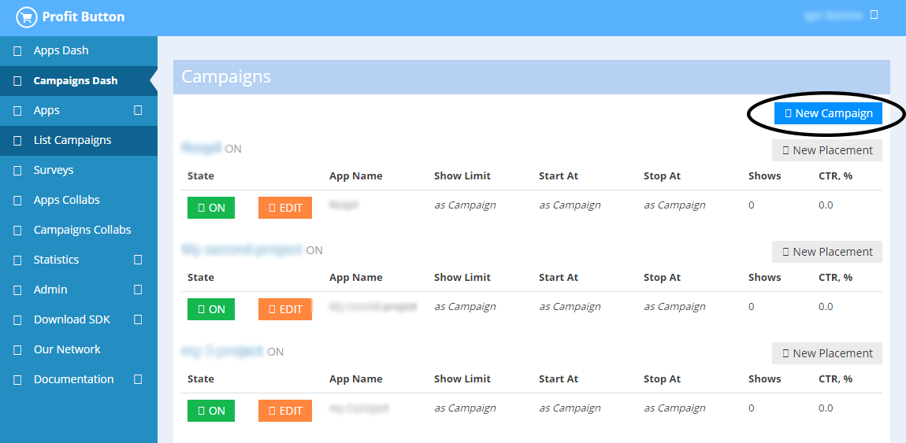
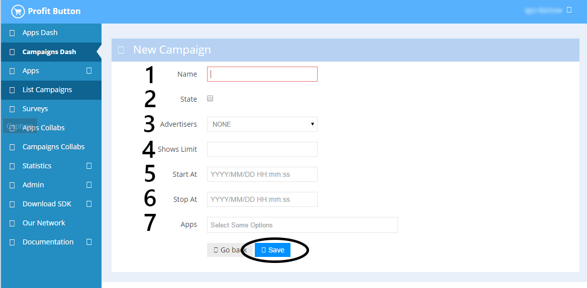
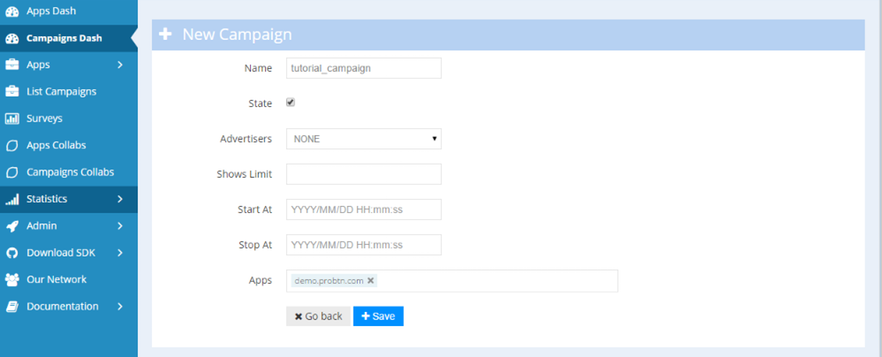
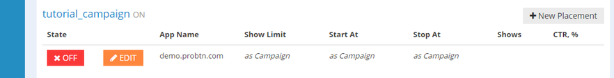
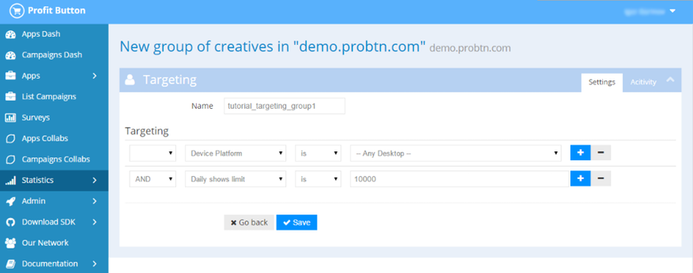
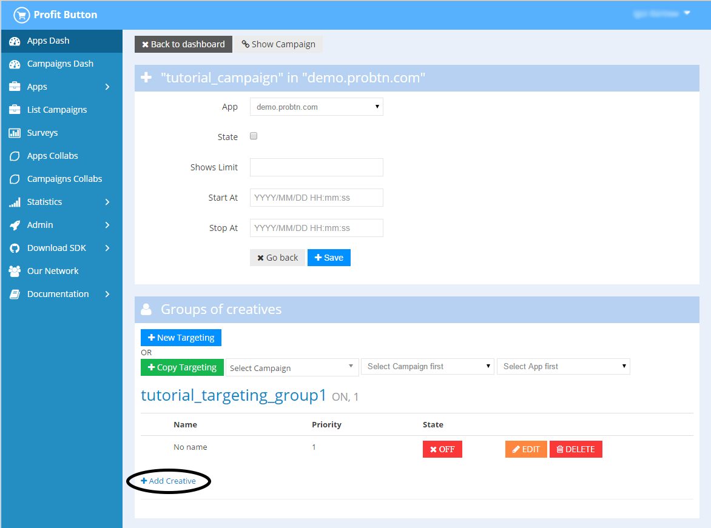
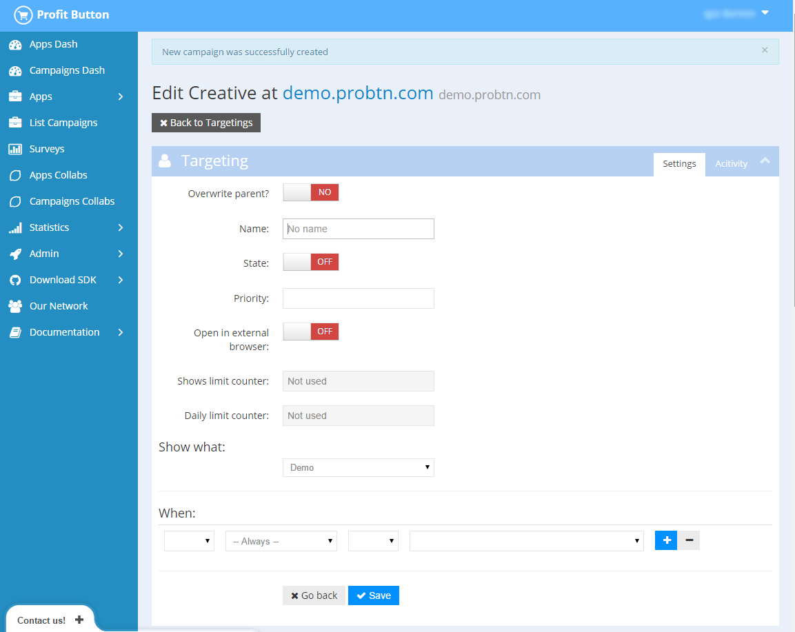
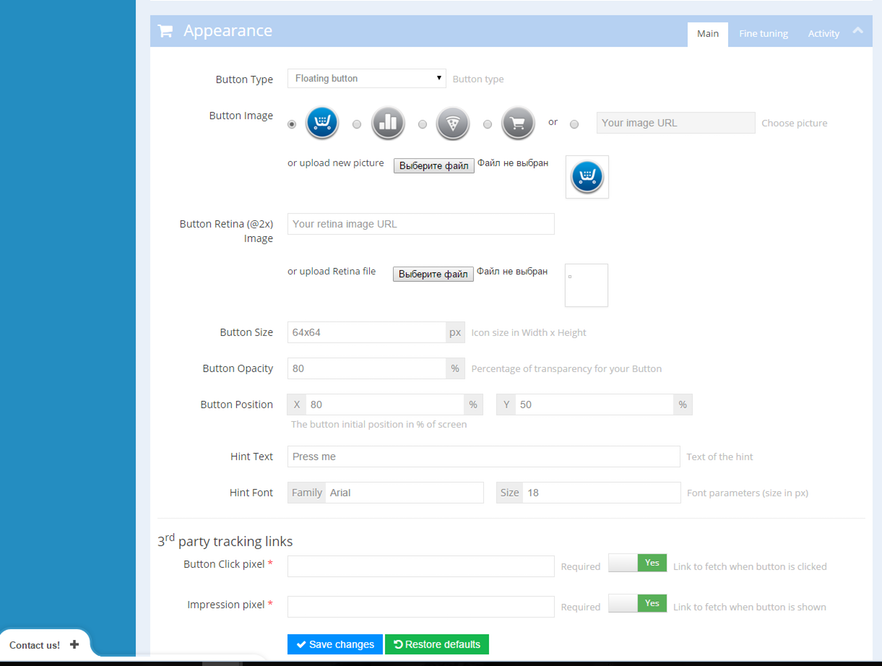

.. probtn documentation master file, created by
   sphinx-quickstart on Mon Nov  2 12:32:08 2015.
   You can adapt this file completely to your liking, but it should at least
   contain the root `toctree` directive.
 
.. _createbutton:
 
Campaign and creative creating
==================================

Step 1 - create campaign
^^^^^^^^^^^^^^^^^^^^^^^^^^^^^^^^^

At page https://admin.probtn.com/adsets using ``New Campaign`` button we start creating a new campaign

Step 2
^^^^^^^^^^^^^^^^^^^^^^^^^^^^^^^^^

Fill base fields of th campaign, such as:

1 - campaign name
2 - state (on\off)
4 - overall show limit for campaign
5 - date and time of campaign start ( format is YYYY/MM/DD HH:mm:ss )
6 - date and time of campaign end ( format is YYYY/MM/DD HH:mm:ss )
7 - apps for campaign

Step 3
^^^^^^^^^^^^^^^^^^^^^^^^^^^^^^^^^

Now we should go at automaticly created Placement (or create new one, if we need so)

and placement

Step 4
^^^^^^^^^^^^^^^^^^^^^^^^^^^^^^^^^

Create new creatives group, by pressing ``New Targeting`` button.

Here we set group name and add nessesary targetings for group, if nessesary.

.. image:: images/creating/6.png

Step 5
^^^^^^^^^^^^^^^^^^^^^^^^^^^^^^^^^

Create creative for created on previous step group.

First of all we set primary button settings, such as state (on\off), show what (what would be shown when user press the button) and open in external browser (would be  page opened at new tab when user press the button) and creative targetings if nessesary.

And then we save this settings.

After it lower at the page we set base button settings (and additional one if nessesary).

Description of all options is available at :ref:`webparams`

