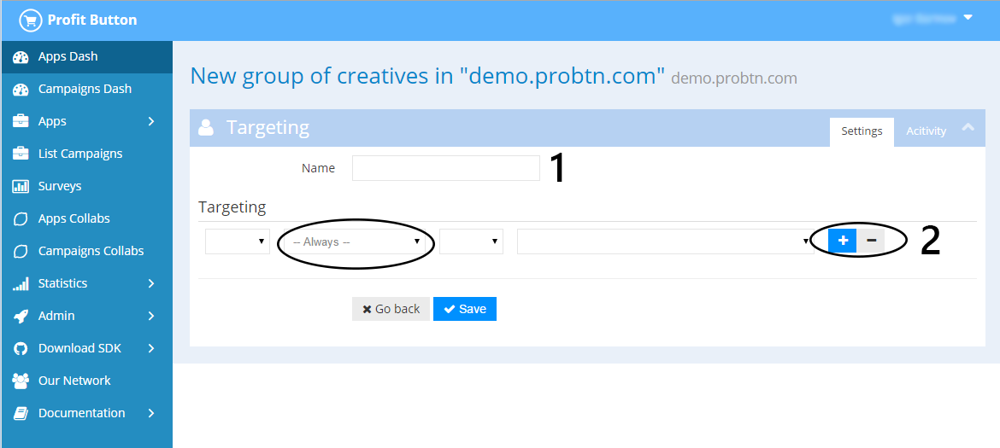

.. probtn documentation master file, created by
   sphinx-quickstart on Mon Nov  2 12:32:08 2015.
   You can adapt this file completely to your liking, but it should at least
   contain the root `toctree` directive.
 
.. _createbutton:
 
Создание кампании и креатива
==================================

Шаг 1 - создание кампании
^^^^^^^^^^^^^^^^^^^^^^^^^^^^^^^^^

На странице https://admin.probtn.com/adsets посредством кнопки New Campaign переходим к созданию новой кампании

Шаг 2
^^^^^^^^^^^^^^^^^^^^^^^^^^^^^^^^^

Заполняем базовые поля формы кампании, в частности

1 - имя кампании
2 - состояние (включена\выключена)
4 - общий лимит показов для кампании
5 - дата и время старта кампании в формате YYYY/MM/DD HH:mm:ss
6 - дата и время завершения кампании в формате YYYY/MM/DD HH:mm:ss
7 - аппы для кампании

.. image:: images/creating/2.png

.. image:: images/creating/3.png

Шаг 3
^^^^^^^^^^^^^^^^^^^^^^^^^^^^^^^^^

Далее переходим к автоматически созданному Placement (либо создаем новый, если таковое требуется

и сам placement

.. image:: images/creating/5.png

Шаг 4
^^^^^^^^^^^^^^^^^^^^^^^^^^^^^^^^^

Создаем новую группу креативов, нажав на New Targeting
Указываем имя группы и необходимые таргетинги для группы, если таковые необходимы

Шаг 5
^^^^^^^^^^^^^^^^^^^^^^^^^^^^^^^^^

Создаем креатив для созданной на предыдущем шаге группе.

.. image:: images/creating/9.png

Первоначально указываем основные настройки кнопки, как то состояние (вкд\выкл), show what (что будет открываться при нажатии на кнопку) и open in external browser (открывать ли страницу в новой вкладке при нажатии на кнопку) и таргетинги для креатива, если таковые необходимы.

.. image:: images/creating/10.png

После чего сохраняем данные настройки.

Затем указываем ниже основные настройки кнопки.
Описание всех параметров доступно на странице :ref:`webparams`

.. image:: images/creating/11.png
