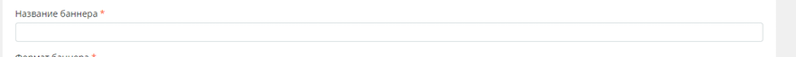
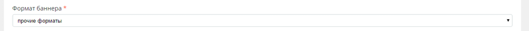

.. probtn documentation master file, created by
   sphinx-quickstart on Mon Nov  2 12:32:08 2015.
   You can adapt this file completely to your liking, but it should at least
   contain the root `toctree` directive.
 
.. _hpmd:
 
HPMD баннер 
==================================

Пример кода hpmd js - http://cdn.probtn.com/custom_include/hpmd_code.js

ВНИМАНИЕ - 

``var domain = 'cosmo.ru';``

``var campaignId = '';``
нужно заменить на актуальные данные

Step 1
^^^^^^^^^^^^^^^^^^^^^^^^^^^^^^^^^

https://developers.hpmdnetwork.ru/console/

Step2
^^^^^^^^^^^^^^^^^^^^^^^^^^^^^^^^^

указать название баннера

Step3
^^^^^^^^^^^^^^^^^^^^^^^^^^^^^^^^^

В качестве формата баннера выбрать "прочие форматы"

Step4
^^^^^^^^^^^^^^^^^^^^^^^^^^^^^^^^^

В поле HTML-код добавить

``

``

Step5
^^^^^^^^^^^^^^^^^^^^^^^^^^^^^^^^^

В поле JS код добавить hpmd адаптированный код для запуска кнопки

Step6
^^^^^^^^^^^^^^^^^^^^^^^^^^^^^^^^^

В JS коде изменить две переменные

``var domain = 'cosmo.ru';``

``var campaignId = '';``

Где для переменной domain указать значение в виде домена аппа, настройки которого необходимо будет использовать.

И для ``campaignId`` указать идентификатор кампании, в случае если нужно использовать конкретную кампанию из выбранного аппа (в ином случае если оставить пустым и в аппе есть несколько активных кампаний - то они будут показываться по очереди).

Значение для ``campaignId`` нужно заменять на идентификатор кампании (не нужно указывать идентификатор placement или creative) либо оставлять пустым.

Сам идентификатор можно найти в адресной строке, открыв страницу кампании (в admin.probtn.com)

.. image:: images/hpmd/5.png

Step7
^^^^^^^^^^^^^^^^^^^^^^^^^^^^^^^^^

Таргетинг не меняем, если таковое не требуется

Step8
^^^^^^^^^^^^^^^^^^^^^^^^^^^^^^^^^

Указать используемые системные события

Step9
^^^^^^^^^^^^^^^^^^^^^^^^^^^^^^^^^

Выбрать главным событием ``hpmd.expand``

.. image:: images/hpmd/8.png

Step10
^^^^^^^^^^^^^^^^^^^^^^^^^^^^^^^^^

Нажать загрузить

Step11
^^^^^^^^^^^^^^^^^^^^^^^^^^^^^^^^^

Если не был указан таргетинг, то еще раз нажать Сохранить несмотря на предупреждение

